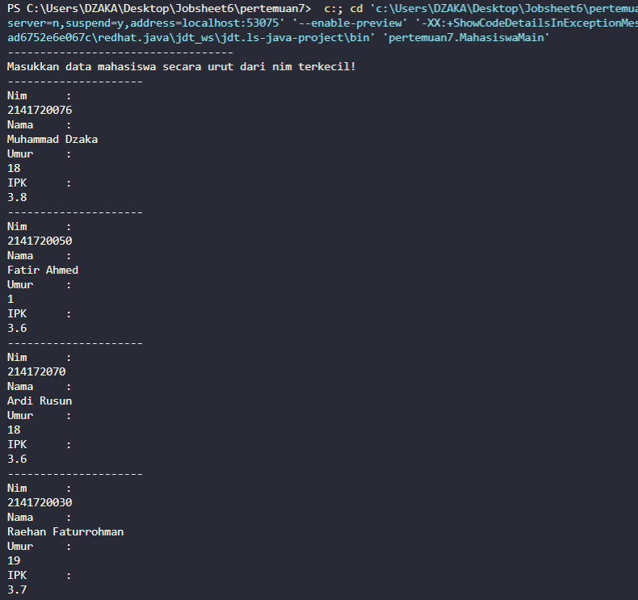
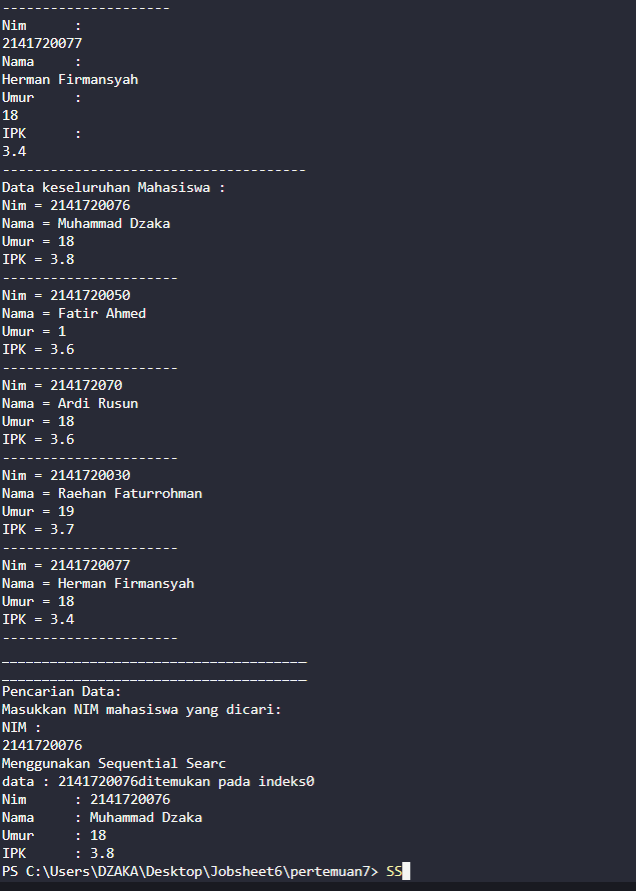
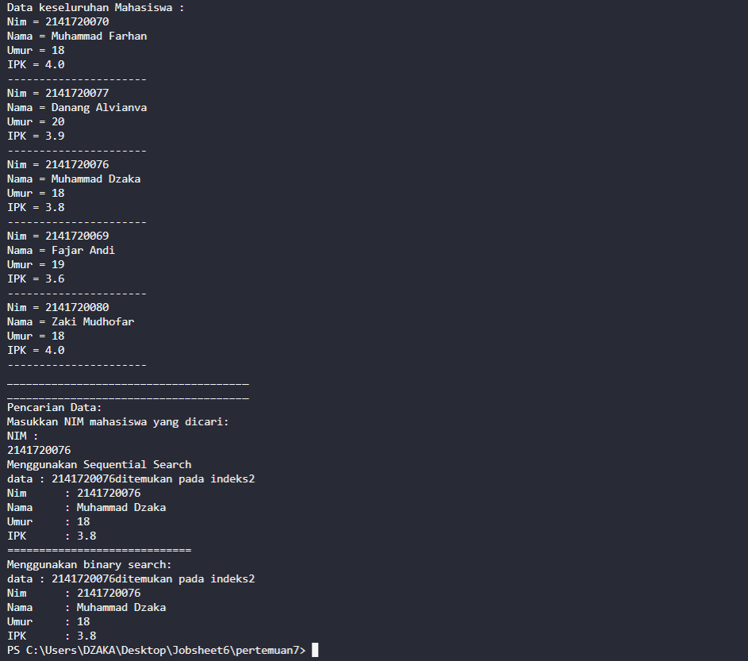
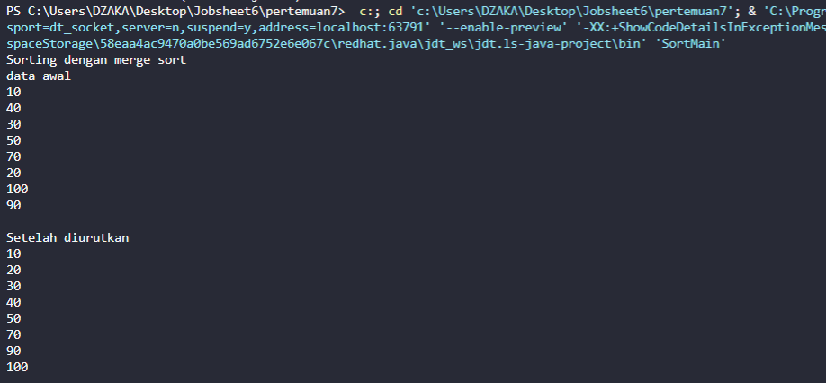
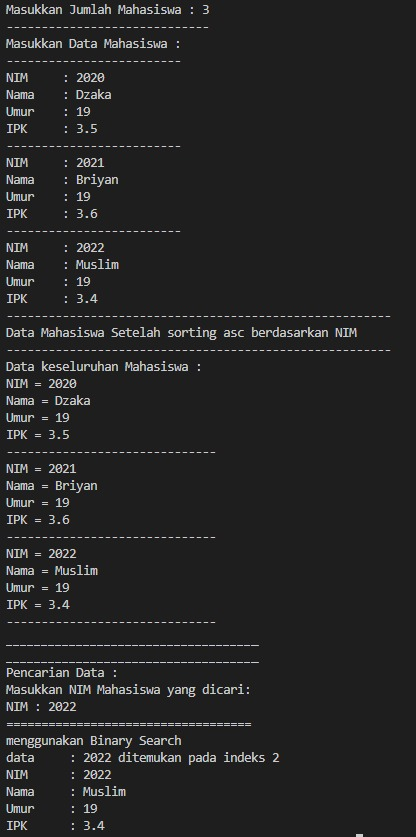
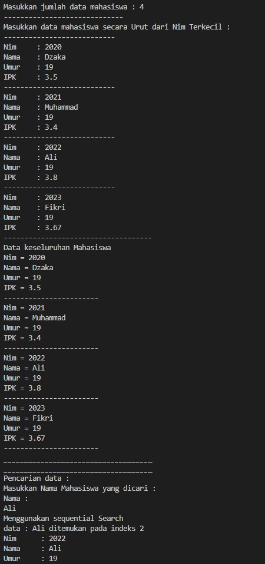
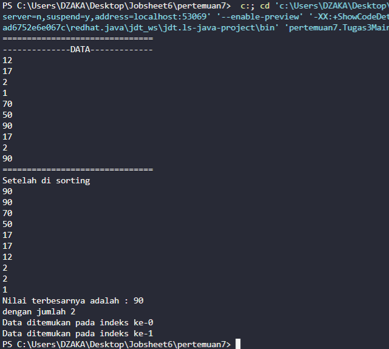

# JOBSHEET 6 : SEARCHING
## Nama : Muhammad Dzaka Murran Rusid
## Kelas/No.Abs: 1F_D4-TI/18

### 6.1. Tujuan Praktikum

Setelah melakukan materi praktikum ini, mahasiswa mampu:

1. Menjelaskan mengenai algoritma Searching.

2. Membuat dan mendeklarasikan struktur algoritma Searching.

3. Menerapkan dan mengimplementasikan algoritma Searching.

### 6.2. Searching / Pencarian Menggunakan Agoritma Sequential Search
Perhatikan diagram class Mahasiswa di bawah ini! Diagram class ini yang selanjutnya akan 
dibuat sebagai acuan dalam membuat kode program class Mahasiswa.
Mahasiswa

Nim: int

nama: String

umur: int

ipk: double

Mahasiswa(ni:int, n: String, u: int, i: double)

tampil(): void

Berdasarkan class diagram di atas, akan dibuat class Mahasiswa yang berfunsi untuk 
membuat objek mahasiswa yang akan dimasukan ke dalam sebuah array. Terdapat sebuah 
konstruktor berparameter dan juga fungsi tampil() untuk menampilkan semua attribute yang ada.

PencarianMhs

listMhs: Mahasiswa[5]

idx: int

tambah(mhs: Mahasiswa): void

tampil(): void

FindSeqSearch(int cari): int

Tampilpoisisi(int x,int pos): void

TampilData(int x,int pos) :void

Selanjutnya class diagram di atas merupakan representasi dari sebuah class yang berfungsi 
untuk melakukan operasi-operasi dari objek array mahasiswa, misalkan untuk menambahkan objek 
mahasiswa, menampilkan semua data mahasiswa, untuk melakukan pencarian berdasarkan NIM 
menggunakan algoritma Sequential Search, menampilkan posisi dari data yang dicari, serta  menampilkan data mahasiswa yang dicari.

#### 6.2.1. Langkah-langkah Percobaan Sequential Search
1. Buatlah Project baru pada Netbeans dengan nama TestSearching
2. Kemuadian buat packages baru dengan nama minggu7.
3. Buat class Mahasiswa, kemudian deklarasikan atribut berikut ini: 
4. Buatlah konstruktor dengan nama Mahasiswa dengan parameter (int ni, String n, 
int u, double i) kemudian Isi konstruktor tersebut dengan kode berikut! 
5. Buatlah method tampil bertipe void.
6. Buat class baru dengan nama PencarianMhs seperti di bawah ini!
7. Tambahkan method tambah() di dalam class tersebut! Method tambah() digunakan untuk 
menambahkan objek dari class Mahasiswa ke dalam atribut listMhs
8. Tambahkan method tampil() di dalam class PencarianMhs! Method tampil()
digunakan untuk menampilkan semua data mahasiswa-mahasiswa yang ada di dalam class 
tersebut! Perhatikan penggunaan sintaks for yang agak berbeda dengan for yang telah dipelajari 
sebelumnya, meskipun secara konsep sebenarnya mirip.
9. Tambahkan method FindSeqSearch bertipe integer dengan parameter cari bertipe integer. 
Kemudian Deklarasikan isi method FindSeqSearch dengan algoritma pencarian data 
menggunakan teknik sequential searching.
10. Buatlah method Tampilpoisisi bertipe void dan Deklarasikan isi dari method 
Tampilpoisisi.
11. Buatlah method TampilData bertipe void dan Deklarasikan isi dari method TampilData.
12. Buatlah class baru dengan nama MahasiswaMain tambahkan method main seperti pada 
gambar berikut!
13. Di dalam method main(), buatlah sebuah objek PencarianMhs dan buatlah 5 objek 
mahasiswa kemudian tambahkan semua objek mahasiswa tersebut dengan memanggil fungsi 
tambah pada objek PencarianMhs.
14. Panggil method tampil() untuk melihat semua data yang telah dimasukan.
15. Untuk melakukan pencarian berdasarkan NIM mahasiswa. Buatlah variable cari yang dapat 
menampung masukan dari keyboard lalu panggil method FindSeqSearch dengan isi 
parameternya adalah variable cari.
16. Lakukan pemanggilan method Tampilposisi dari class PencarianMhs.
17. Lakukan pemanggilan method TampilData dari class PencarianMhs.
18. Jalankan dan amati hasilnya. 
```java
package pertemuan7; //class code
public class Mahasiswa{
    int nim;
    String nama;
    int umur;
    double ipk;

    Mahasiswa(int ni, String n, int u, double i){
        nim = ni;
        nama = n;
        umur = u;
        ipk = i;
    }

    void tampil(){
        System.out.println("Nim = "+nim);
        System.out.println("Nama = "+nama);
        System.out.println("Umur = "+umur);
        System.out.println("IPK = "+ipk);
    }
}
```

```java
package pertemuan7; //class MahasiswaMain.java

public class PencarianMhs {
    Mahasiswa listMhs[] = new Mahasiswa[5];
    int idx;

    void tambah(Mahasiswa m){
        if(idx < listMhs.length){
            listMhs[idx] = m;
            idx++;
        }else{
            System.out.println("Data sudah penuh!!");
        }
    }
    
    void tampil(){
        for(Mahasiswa m : listMhs){
            m.tampil();
            System.out.println("----------------------");
        }
    }
    
    public int FindSeqSearch(int cari){
        int posisi = -1;
        for(int j=0;j<listMhs.length;j++){
            if(listMhs[j].nim==cari){
                posisi = j;
                break;
            }
        }
        return posisi;
    }

    public void tampilPosisi(int x, int pos){
        if(pos!= -1){
            System.out.println("data : " +x+ "ditemukan pada indeks" + pos);
        }else{
            System.out.println("data " +x+ "tidak ditemukan");
        }
    }

    public void tampilData(int x, int pos){
        if (pos!= -1){
            System.out.println("Nim\t : " +x);
            System.out.println("Nama\t : " +listMhs[pos].nama);
            System.out.println("Umur\t : " +listMhs[pos].umur);
            System.out.println("IPK\t : " +listMhs[pos].ipk);
        }
    }
}

```

```java
package pertemuan7; //class main code
import java.util.Scanner;
public class MahasiswaMain {
    public static void main(String[] args){
        Scanner s = new Scanner(System.in);
        Scanner sl = new Scanner(System.in);

        PencarianMhs data = new PencarianMhs();
        int juMhs = 5;

        System.out.println("-----------------------------------");
        System.out.println("Masukkan data mahasiswa secara urut dari nim terkecil!");
        for(int i=0;i<juMhs;i++){
            System.out.println("---------------------");
            System.out.println("Nim\t : ");
            int nim = s.nextInt();
            System.out.println("Nama\t :");
            String nama = sl.nextLine();
            System.out.println("Umur\t : ");
            int umur = s.nextInt();
            System.out.println("IPK\t : ");
            double ipk = s.nextDouble();

            Mahasiswa m = new Mahasiswa(nim, nama, umur, ipk);
            data.tambah(m);
        }
    
        System.out.println("--------------------------------------");
        System.out.println("Data keseluruhan Mahasiswa : ");
        data.tampil();

        System.out.println("______________________________________");
        System.out.println("______________________________________");
        System.out.println("Pencarian Data: ");
        System.out.println("Masukkan NIM mahasiswa yang dicari: ");
        System.out.println("NIM : ");
        int cari = s.nextInt();
        System.out.println("Menggunakan Sequential Searc");
        int posisi = data.FindSeqSearch(cari);
        data.tampilPosisi(cari, posisi);
        data.tampilData(cari, posisi);

    }
}

```

#### 6.2.2. Verifikasi Hasil Percobaan



#### 6.2.3. Pertanyaan
1. Jelaskan perbedaan metod TampilData dan Tampilposisi pada class PencarianMhs
<br>

**Jawaban:**

**-tampil posisi memberi tahu apakah data tersebut ada di index berapa**

**-tampil data memberi nilai yang ada di dalam index yang ada di tampilposisi**

2. Jelaskan fungsi break pada kode program dibawah ini! 
```java
if (listMhs[j].nim cari)
```
<br>

**Jawaban: Untuk menghentikan atau keluar dari perulangan**
3. Jika Data Nim yang dimasukkan tidak terurut dari kecil ke besar. Apakah program masih dapat 
berjalan? Apakah hasil yang dikeluarkan benar? Mengapa demikian!
<md>
**Jawaban: Bisa, karena pada proses pencarian dilakukan dengan cara membandingkan elemen array satu per satu secara beruntun mulai dari elemen pertama sampai elemen yang dicari/key element sudah ditemukan atau sampai semua elemen sudah diperiksa**

### 6.3. Searching / Pencarian Menggunakan Binary Search

#### 6.3.1. Langkah-langkah Percobaan Binary Search
1. Pada percobaan 6.2.1 (sequential search) tambahkan method FindBinarySearch bertipe 
integer pada class PencarianMhs. Kemudian Deklarasikan isi method FindBinarySearch
dengan algoritma pencarian data menggunakan teknik binary searching
2. Panggil method FindBinarySearch terdapat pada class PencarianMhs di kelas
Mahasiswamain. Kemudia panggil method tampilposisi dan tampilData
3. Jalankan dan amati hasilnya. 

#### 6.3.2. Verifikasi Hasil Percobaan


#### 6.3.3. Pertanyaan
1. Tunjukkan pada kode program yang mana proses divide dijalankan!
<br>

**Jawaban:**

```java
    public int FindBinarySearch(int cari, int left, int right) {
        int mid;
        if (right >= left) {
            mid = (left + right) / 2;
            
```
2. Tunjukkan pada kode program yang mana proses conquer dijalankan!
<br>

**Jawaban:**
```java
            if (cari == listMhs[mid].nim) {
                return (mid);
            } else if (listMhs[mid].nim > cari) {
                return FindBinarySearch(cari, left, mid - 1);
            } else {
                return FindBinarySearch(cari, right, mid + 1);
            }
        }
        return -1;
```

3. Jika data Nim yang dimasukkan tidak urut. Apakah program masih dapat berjalan? Mengapa demikian?
<br>
**Jawaban: Program masih dapat berjalan, tetapi binary akan meng-output-kan data tidak ditemukan. Karena algoritma binary search pada dasarnya memerlukan baris data yang telah terurut, sehingga program tetep berjalan namun binary search tidak akan berjalan.**
4. Jika Nim yang dimasukkan dari NIM terbesar ke terkecil (missal : 20215, 20214, 20212, 20211, 20210) dan elemen yang dicari adalah 20210. Bagaimana hasil dari binary search? Apakah 
sesuai? Jika tidak sesuai maka ubahlah kode program binary seach agar hasilnya sesuai
<br>

**Jawaban:**
**Tidak ditemukan, kode modif:**
```java
public int FindBinarySearch(int cari, int left, int right) {
        int mid;
        if (right >= left) {
            mid = (left + right) / 2;
            if (cari == listMhs[mid].nim) {
                return (mid);
            } else if (listMhs[mid].nim < cari) {
                return FindBinarySearch(cari, left, mid - 1);
            } else {
                return FindBinarySearch(cari, right, mid + 1);
            }
        }
        return -1;
    }
```
5. Modifikasilah program diatas yang mana jumlah mahasiswa yang di inputkan sesuai dengan 
masukan dari keyboard.
```java
System.out.print("Masukkan jumlah data Mahasiswa : ");
        int jumMhs = s.nextInt();
        Mahasiswa[] m = new Mahasiswa[jumMhs];
        data.listMhs = m;
```

### 6.4. Percobaan Pengayaan Divide and Conquer
#### 6.4.1. Langkah-langkah Percobaan Merge Sort
1. Buatlah Package baru pada NetBeans dengan nama MergeSortTest
2. Tambahkan class MergeSorting pada package tersebut
3. Pada class MergeSorting buatlah method mergeSort yang menerima parameter data array 
yang akan diurutkan
4. Buatlah method merge untuk melakukan proses penggabungan data dari bagian kiri dan kanan. 
5. Implementasikan proses merge sebagai berikut. 
6. Buatlah method sort
7 Implementasikan kode berikut pada method sort
8 Pada method mergeSort, panggil method sort dengan parameter data yang ingin diurutkan 
serta range data awal sampai dengan akhir.
9 Tambahkan method printArray
10 Sebagai langkah terakhir, deklarasikan data yang akan diurutkan kemudian panggil proses 
sorting pada class SortMain

#### 6.4.2. Verifikasi Hasil Percobaan


### 6.5. Latihan Praktikum
1. Modifikasi percobaan searching diatas dengan ketentuan berikut ini
- Sebelum dilakukan searching dengan binary search data harus dilakukan pengurutan dengan 
menggunakan algoritma sorting (pilih salah satu algoritma sorting dari pertemuan 
sebelumnya)

**Jawaban**

```java
public class tugas1 {   //class Mahasiswa
    int nim;
    String nama;
    int umur;
    double ipk;

    tugas1(int ni, String n, int u, double i) {
        nim = ni;
        nama = n;
        umur = u;
        ipk = i;
    }

    void tampil() {
        System.out.println("NIM = " + nim);
        System.out.println("Nama = " + nama);
        System.out.println("Umur = " + umur);
        System.out.println("IPK = " + ipk);
    }
}
```

```java
import java.util.Scanner;   //Class Main Mahasiswa
public class tugas1Main {
    
    public static void main(String[] args) {
        Scanner s = new Scanner(System.in);
        Scanner sl = new Scanner(System.in);

        tugas1Search data = new tugas1Search();
        System.out.print("Masukkan Jumlah Mahasiswa : ");
        int jumMhs = s.nextInt();
        tugas1[] x = new tugas1[jumMhs];
        data.listMhs = x;

        System.out.println("-----------------------------");
        System.out.println("Masukkan Data Mahasiswa :");
        for (int i = 0; i < jumMhs; i++) {
            System.out.println("-------------------------");
            System.out.print("NIM\t: ");
            int nim = s.nextInt();
            System.out.print("Nama\t: ");
            String nama = sl.nextLine();
            System.out.print("Umur\t: ");
            int umur = s.nextInt();
            System.out.print("IPK\t: ");
            double ipk = s.nextDouble();

            tugas1 m = new tugas1(nim, nama, umur, ipk);
            data.tambah(m);
        }

        System.out.println("-------------------------------------------------------");
        System.out.println("Data Mahasiswa Setelah sorting asc berdasarkan NIM");
        System.out.println("-------------------------------------------------------");
        System.out.println("Data keseluruhan Mahasiswa : ");
        data.tampil();
        data.selectionSort();

        System.out.println("____________________________________");
        System.out.println("____________________________________");
        System.out.println("Pencarian Data : ");
        System.out.println("Masukkan NIM Mahasiswa yang dicari: ");
        System.out.print("NIM : ");
        int cari = s.nextInt();

        System.out.println("===================================");
        System.out.println("menggunakan Binary Search");
        int posisi = data.FindBinarySearch(cari, 0, jumMhs - 1);

        data.Tampilposisi(cari, posisi);
        data.TampilData(cari, posisi);
        
        s.close();
        sl.close();
    }
}
```

```java
public class tugas2 {     //class PencarianMhs
    tugas1 listMhs[];
    int idx;

    void tambah(tugas1 m) {
        if (idx < listMhs.length) {
            listMhs[idx] = m;
            idx++;
        } else {
            System.out.println("Data sudah penuh !!");
        }
    }

    void tampil() {
        for (tugas1 m : listMhs) {
            m.tampil();
            System.out.println("------------------------------");
        }
    }

    void selectionSort() {
        for (int i = 0; i < listMhs.length; i++) {
            int idxMin = 1;
            for (int j = i + 1; j < listMhs.length; j++) {
                if (listMhs[j].nim < listMhs[idxMin].nim) {
                    idxMin = j;
                }
            }
        }
    }

    public void Tampilposisi(int x, int pos) {
        if (pos != -1) {
            System.out.println("data\t : " + x + " ditemukan pada indeks " + pos);
        } else {
            System.out.println("data " + x + "tidak ditemukan");
        }
    }

    public void TampilData(int x, int pos) {
        if (pos != -1) {
            System.out.println("NIM\t : " + x);
            System.out.println("Nama\t : " + listMhs[pos].nama);
            System.out.println("Umur\t : " + listMhs[pos].umur);
            System.out.println("IPK\t : " + listMhs[pos].ipk);
        } else {
            System.out.println("data " + x + "tidak ditemukan");
        }
    }

    public int FindBinarySearch(int cari, int left, int right) {
        int mid;
        if (right >= left) {
            mid = (left + right) / 2;
            if (cari == listMhs[mid].nim) {
                return (mid);
            } else if (listMhs[mid].nim > cari) {
                return FindBinarySearch(cari, left, mid - 1);
            } else {
                return FindBinarySearch(cari, mid + 1, right);
            }
        }
        return -1;
    }
}
```

2. Modifikasi percobaan searching diatas dengan ketentuan berikut ini
- Pencarian dilakukan berdasarkan Nama Mahasiswa (gunakan Algoritma Sequential Search)
- Jika terdapat nama yang sama? Bagaimana keluaran dari kode program ketika pencarian 
dilakukan pada nama yang sama!

**Jawaban**

```java
public class tugas1Search {
    tugas1 listMhs[];
    int idx;

    void tambah(tugas1 m) {
        if (idx < listMhs.length) {
            listMhs[idx] = m;
            idx++;
        } else {
            System.out.println("Data sudah penuh !!");
        }
    }

    void tampil() {
        for (tugas1 m : listMhs) {
            m.tampil();
            System.out.println("------------------------------");
        }
    }

    void selectionSort() {
        for (int i = 0; i < listMhs.length; i++) {
            int idxMin = 1;
            for (int j = i + 1; j < listMhs.length; j++) {
                if (listMhs[j].nim < listMhs[idxMin].nim) {
                    idxMin = j;
                }
            }
        }
    }

    public void Tampilposisi(int x, int pos) {
        if (pos != -1) {
            System.out.println("data\t : " + x + " ditemukan pada indeks " + pos);
        } else {
            System.out.println("data " + x + "tidak ditemukan");
        }
    }

    public void TampilData(int x, int pos) {
        if (pos != -1) {
            System.out.println("NIM\t : " + x);
            System.out.println("Nama\t : " + listMhs[pos].nama);
            System.out.println("Umur\t : " + listMhs[pos].umur);
            System.out.println("IPK\t : " + listMhs[pos].ipk);
        } else {
            System.out.println("data " + x + "tidak ditemukan");
        }
    }

    public int FindBinarySearch(int cari, int left, int right) {
        int mid;
        if (right >= left) {
            mid = (left + right) / 2;
            if (cari == listMhs[mid].nim) {
                return (mid);
            } else if (listMhs[mid].nim > cari) {
                return FindBinarySearch(cari, left, mid - 1);
            } else {
                return FindBinarySearch(cari, mid + 1, right);
            }
        }
        return -1;
    }
}
```



3. Terdapat sebuah data array 1 dimensi sebagai berikut 

    0 1 2 3 4 5 6 7 8 9

    12 17 2 1 70 50 90 17 2 90 

    Buatlah program untuk mengurutkan array tersebut (boleh memilih metode pengurutan) selanjutnya lakukan pencarian dan mencetak isi array yang nilainya terbesar, dan mencetak ada  berapa buah nilai terbesar tersebut serta berada dilokasi mana saja nilai terbesar tersebut! (menggunakan binary search)!

    **Jawaban**
    <br>
```java
package pertemuan7; //class code
public class Tugas3 {
        public int[] data;
        public int max = 0;
        public int posisi;
        public int jumlah = 0;
    
        Tugas3(int nilai[]) {
            data = nilai;
        }
    
        void tampil() {
            for (int i = 0; i < data.length; i++) {
                System.out.print(data[i] + " ");
                System.out.println();
            }
        }
    
        void bubblesort() {
            for (int i = 0; i < data.length - 1; i++) {
                for (int n = 1; n < data.length - i; n++) {
                    if (data[n] > data[n - 1]) {
                        int tmp = data[n];
                        data[n] = data[n - 1];
                        data[n - 1] = tmp;
                    }
                }
            }
        }
    
        public int Searching(int cari, int kiri, int kanan) {
            int mid;
            if (kanan >= kiri) {
                mid = (kiri + kanan) / 2;
                if (cari == data[mid]) {
                    return (mid);
                } else if (data[mid] > cari) {
                    return Searching(cari, mid + 1, kanan);
                } else {
                    return Searching(cari, kiri, mid - 1);
                }
            }
            return -1;
        }
    
        public int nilaiTerbesar() {
            for (int i = 0; i < data.length; i++) {
                if (data[i] > max) {
                    max = data[i];
                }
            }
            System.out.println("Nilai terbesarnya adalah : " + max);
            return max;
        }
    
        public void tampilPosisi(int pos) {
            for (int i = 0; i < data.length; i++) {
                if (data[i] == max) {
                    jumlah++;
                }
            }
            System.out.print("dengan jumlah " + jumlah);
            System.out.println();
            posisi = max;
            for (int i = 0; i < data.length; i++) {
                if (posisi == data[i]) {
                    pos = i;
                    System.out.println("Data ditemukan pada indeks ke-" + pos);
                }
            }
        }
    }

```

```java
package pertemuan7; //class main code
public class Tugas3Main {
    public static void main(String[] args) {
        int bil[] = {12, 17, 2, 1, 70, 50, 90, 17, 2, 90};
        
        Tugas3 arr = new Tugas3(bil);
        
        int jum = 10;
        int max = 0;
        System.out.println("===============================");
        System.out.println("--------------DATA-------------");
        arr.tampil();
        arr.bubblesort();
        System.out.println("===============================");
        System.out.println("Setelah di sorting");
        arr.tampil();
        arr.nilaiTerbesar();
        arr.Searching(max, 0, jum - 1);
        arr.tampilPosisi(max);
    }
}

```
